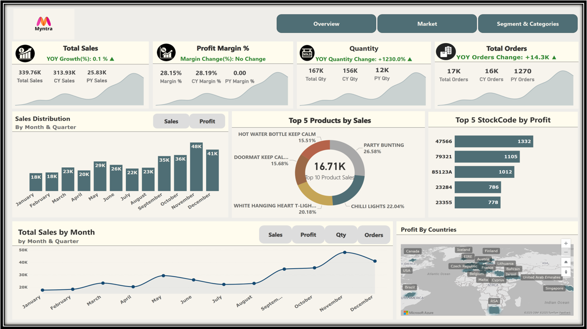
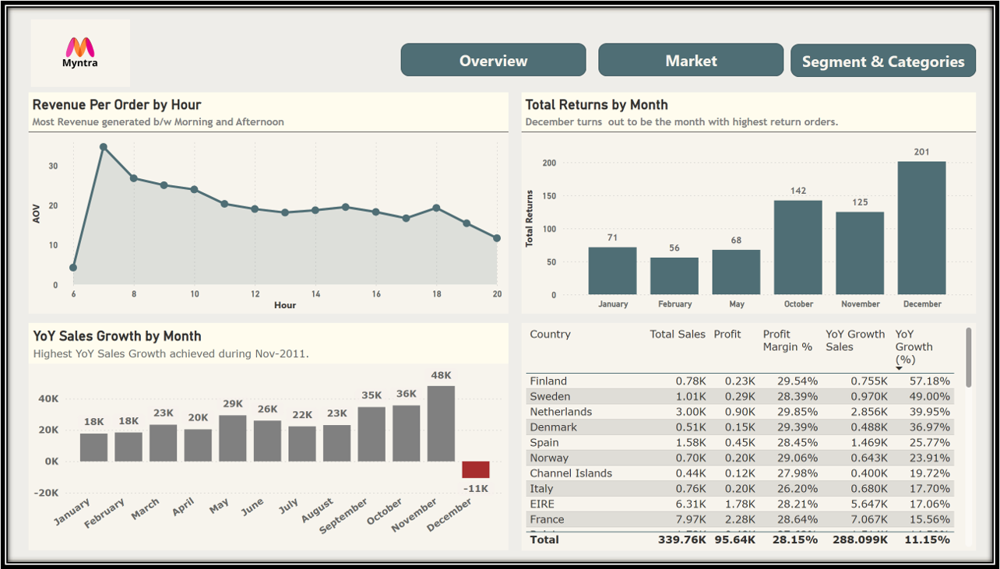

# Myntra Sales Analysis

A comprehensive exploratory data analysis (EDA) and customer segmentation of Myntra Gifts Ltd.'s online retail sales data, uncovering actionable insights into sales trends, customer behavior, and product performance.

## Table of Contents
- [Introduction](#introduction)
- [Features](#features)
- [Dataset Overview](#dataset-overview)
- [Installation](#installation)
- [Usage](#usage)
- [Key Insights](#key-insights)
- [Recommendations](#recommendations)
- [Power BI Dashboard](#power-bi-dashboard)
- [Contributing](#contributing)
- [License](#license)
- [Contact](#contact)

## Introduction
This project analyzes sales data from Myntra Gifts Ltd., a UK-based division of Myntra specializing in unique all-occasion giftware, covering transactions from December 1, 2009, to December 9, 2011. The goal is to extract valuable insights to enhance business strategies by identifying purchasing trends, evaluating product performance, and understanding customer behavior. The dataset includes 328,610 records across 20 columns, providing a detailed snapshot of international online retail activities.

**Author**: Harddik Singh  
**Published**: June 30, 2025

## Features
- **Sales & Revenue Trends**: Analyzes monthly and quarterly revenue, average order value (AOV), and price trends.
- **Customer Behavior Analysis**: Examines purchase patterns across weekdays/weekends, peak hours, and months.
- **Product Performance**: Identifies top-performing products by revenue and quantity, and analyzes unit price distributions.
- **Country-Level Insights**: Evaluates revenue contributions and pricing variations across countries.
- **Time & Purchase Patterns**: Highlights peak invoice hours and day-of-week trends.
- **RFM Analysis**: Segments customers based on Recency, Frequency, and Monetary metrics.
- **K-Means Clustering**: Groups customers into actionable segments using machine learning.
- **Statistical Significance Testing**: Provides confidence intervals and hypothesis testing for key metrics.

## Dataset Overview
The dataset (`myntra_sales.db`) contains 328,610 records with 20 columns, including:
- **Key Variables**: `InvoiceNo`, `StockCode`, `Description`, `Quantity`, `InvoiceDate`, `UnitPrice`, `CustomerID`, `Country`, `Total_Revenue`, `Items_Per_Invoice`, etc.
- **Data Quality**: No duplicates or missing values, ensuring robust analysis.
- **Time Frame**: December 1, 2009, to December 9, 2011.
- **Scope**: International online retail transactions for Myntra Gifts Ltd.

## Installation
To run the analysis, follow these steps:

1. **Clone the Repository**:
   ```bash
   git clone https://github.com/username/myntra-sales-analysis.git
   cd myntra-sales-analysis
   ```

2. **Install Dependencies**:
   Ensure Python 3.8+ is installed. Install required libraries:
   ```bash
   pip install pandas numpy matplotlib seaborn cufflinks plotly scikit-learn scipy
   ```

3. **Set Up Power BI (Optional)**:
   Install [Power BI Desktop](https://powerbi.microsoft.com/desktop/) for interactive dashboard exploration.

4. **Set Up the Database**:
   Place the `myntra_sales.db` SQLite database in the project root directory.

5. **Environment Setup**:
   Create a `.env` file for sensitive configurations (e.g., database paths), though not required for this project.

## Usage
1. **Load the Dataset**:
   Run the provided Jupyter notebook or Python script to connect to the SQLite database:
   ```python
   import sqlite3
   import pandas as pd
   conn = sqlite3.connect('myntra_sales.db')
   df = pd.read_sql_query("SELECT * FROM myntra_sales_summary", conn)
   ```

2. **Run the Analysis**:
   Execute the analysis scripts to generate visualizations and insights. Key analyses include:
   - Sales trends (monthly/quarterly revenue, AOV).
   - Customer segmentation (RFM and K-Means clustering).
   - Statistical tests (confidence intervals, t-tests).

3. **Explore the Power BI Dashboard**:
   Import the provided `.pbix` file into Power BI Desktop to interact with visualizations (see [Power BI Dashboard](#power-bi-dashboard)).

4. **View Results**:
   Results are displayed as plots (e.g., bar charts, histograms, 3D scatter plots) and printed outputs. Refer to the `Myntra_report.html` for detailed visualizations.

## Key Insights
### Sales & Revenue Trends
- **Monthly Revenue**: Peaks in November (~$600K from report, ~$48K YoY growth in 2011 from dashboard), lowest in February (~$200K from report).
- **Quarterly Revenue**: Q4 2025 is the strongest (~$1.4M from report), with steady growth from Q1.
- **Average Order Value (AOV)**: Highest in October (~$303 from report), with peak revenue per order at 6 AM (~$30 AOV from dashboard).
- **Year-over-Year (YoY) Growth**: Total sales grew 0.1% YoY (dashboard), with the highest YoY sales growth in November 2011 (~$48K, dashboard).
- **Price Trends**: Unit prices increase from July 2025 to February 2026, stabilizing quarterly at ~$12-$12.50 (report).
- **Returns**: December has the highest returns (142 orders, dashboard), with a return rate spike of 35.3% in Spain (dashboard).
- **Profit Margin**: Overall profit margin is 28.15%, with a total profit of $95.64K (dashboard).

### Customer Behavior
- **Items Per Invoice**: Top 10% of invoices average 888.8 items, while the bottom 50% average 108.8 (report), indicating large orders drive sales.
- **Weekday vs. Weekend**: Weekdays have higher AOV (~$256 from report), with morning hours (6-12 AM) generating the most revenue (dashboard).
- **Peak Hours**: Purchases peak between 6 AM and 12 PM, especially at 6 AM (~2840 invoices from report, ~$30 AOV from dashboard).
- **Order Frequency**: Customer ID 14911 has the highest order frequency (2159 orders, dashboard), followed by 12748 (850 orders, dashboard).
- **Sales Growth**: Highest YoY sales growth achieved in November 2011 (~$48K, dashboard).
- **Customer Spending**: Top 5 customers by total spend range from $66K to $149K (dashboard).

### Product Performance
- **Top Products**: StockCode 47566 generates the highest revenue (>30,000 from report), while "Hot Water Bottle Keep Calm" leads sales at 15.51% (dashboard). "Pack of 72 Retrospot Cake Cases" leads in quantity (24.42% from report).
- **Unit Price Distribution**: Most products are priced ≤$10 (report), with top 5 StockCodes by average order value ranging from $25.92 to $85.37 (dashboard).
- **Profit by StockCode**: StockCode 47566 tops profit at 1332 units, followed by 79321 (1105 units, dashboard).
- **Order Frequency by Product**: "White Hanging Heart T-Light" and "Party Bunting" show high order frequency (120 and 102 orders, respectively, dashboard).
- **Top 5 Products by Revenue**: Includes "Jumbo Bag Red Retrospot" ($85.37 AOV), "Regency Teapot" ($70.69 AOV), and others (dashboard).

### Country-Level Insights
- **Revenue Contribution**: The UK dominates (90.2% from report), with total sales of $339.76K across top countries (dashboard).
- **Pricing Variations**: Norway and Belgium have higher median unit prices (~$4-$6 from report), while top 5 countries (e.g., Netherlands $3.0K, Spain $1.6K) show varied sales (dashboard).
- **Returns and Profit Margin**: Spain has the highest return rate (35.3%, dashboard), while Saudi Arabia has the lowest profit margin (-57.80%, dashboard).
- **Profit by Country**: EIRE leads with $7.97K profit and 28.64% margin, while Channel Islands show a loss (-11K, dashboard).
- **Sales Overview**: Netherlands ($3.0K), Spain ($1.6K), and Sweden ($1.0K) are top contributors by sales (dashboard).
- **Country Performance**: France shows a profit of $6.1K with a 21.2% margin, while Portugal has a loss of -$0.5K (dashboard).

### Customer Segmentation
- **RFM Analysis**: Segments customers into "Best Customers" (12% of total), "Loyal Customers" (22%), and others, with balanced score distribution (report).
- **K-Means Clustering**: Identifies 4 clusters (Loyal, Potential, Lost, New/Inactive), with a silhouette score of 0.591 (report).
- **Top Customers**: Customer ID 14911 leads in quantity sold (2159 orders), followed by 12748 (850 orders, dashboard).
- **Customer Profit Contribution**: Top 5 customers contribute $66K to $149K in profit (dashboard).

### Statistical Tests
- **AOV Confidence Intervals**: Top-selling products have a 95% CI of $206.10-$212.38 (mean: $209.24), vs. low-selling at $10.17-$11.72 (mean: $10.94, report).
- **T-Test**: Significant difference in AOV between top and low-performing vendors (t=120.169, p<0.05, report).
- **Purchase Frequency**: High-value customers (top 20%) average 10.74 purchases (CI: 9.84-11.63), vs. low-value at 2.34 (CI: 2.27-2.40, report).

## Recommendations
Based on the analysis, the following strategies can optimize Myntra Gifts Ltd.'s business performance:
- **Target High-Value Customers**: Focus retention efforts on "Best Customers" (e.g., Customer ID 14911 with 2159 orders, top 5 with $66K-$149K spend) and "Loyal Customers" (22%) with personalized promotions or loyalty programs.
- **Boost Off-Peak Sales**: Increase marketing during low-performing months (e.g., February, June) and evening hours (post-6 PM) with flash sales or discounts, leveraging the morning revenue peak (6 AM, ~$30 AOV).
- **Optimize Product Portfolio**: Promote top-performing products (e.g., "Hot Water Bottle Keep Calm" at 15.51%, "Jumbo Bag Red Retrospot" at $85.37 AOV) through bundling. Review low-profit items (e.g., Saudi Arabia’s -57.80% margin) and high-return products (Spain, 35.3%) for profitability adjustments.
- **Expand International Markets**: Leverage the UK’s dominance ($339.76K total sales) while targeting high-profit countries like EIRE (28.64% margin) and France (21.2% margin), and address low-margin markets (e.g., Saudi Arabia) with pricing strategies.
- **Enhance Midweek Engagement**: Capitalize on midweek peaks (Wednesday-Friday from report) by scheduling promotions, aligning with November’s $48K YoY growth.
- **Reduce Returns**: Investigate Spain’s 35.3% return rate and December’s 142 returns, implementing quality checks or customer education to minimize returns.
- **Refine Customer Acquisition**: Convert "Potential Customers" into "Loyal Customers" with targeted marketing, using insights from top customers (e.g., 14911, 12748) and their profit contribution ($66K-$149K).

## Power BI Dashboard
The Power BI dashboard provides an interactive interface to explore the Myntra Sales Analysis insights. It is available as `myntra_sales_dashboard.pbix` in the repository.

### Features
- **Interactive Visualizations**: Includes bar charts for monthly sales ($48K peak in November 2011), line graphs for AOV by hour (peak at 6 AM, ~$30), and pie charts for top products ("Hot Water Bottle Keep Calm" at 15.51%, "Jumbo Bag Red Retrospot" at $85.37 AOV).
- **Filters and Slicers**: Filter by country (e.g., UK, EIRE), product (e.g., StockCode 47566), or time period (e.g., November 2011, Q4) to drill down into trends.
- **Key Metrics**: Displays total sales ($339.76K), profit ($95.64K, 28.15% margin), top customer order frequency (14911 with 2159 orders), and top 5 customer spend ($66K-$149K).
- **Customer Segmentation**: Visualizes top customers by quantity sold and profit contribution, and countries with lowest profit margins (e.g., Saudi Arabia at -57.80%).
- **Time-Based Analysis**: Shows peak revenue hours (6-12 AM), monthly returns (December peak at 142), and YoY growth (0.1% overall, 48K in November 2011).

### Usage
1. **Open the Dashboard**:
   - Download `myntra_sales_dashboard.pbix` from the repository.
   - Open in Power BI Desktop.
2. **Connect to Data**:
   - Link to `myntra_sales.db` via Mysql connector or import the CSV equivalent.
3. **Interact with Visuals**:
   - Use slicers to filter by country (e.g., Spain for returns), product (e.g., 47566 for profit), or month (e.g., November for growth).
   - Hover over charts for details, such as France’s $6.1K profit or Spain’s 35.3% return rate.
4. **Export Insights**:
   - Export visuals to PowerPoint or PDF for presentations using Power BI's export functionality.

### Dashboard Screenshot




*Note*: Ensure the `images/` folder contains the dashboard screenshot for proper rendering in the README.

## Contributing
Contributions are welcome! To contribute:
1. Fork the repository.
2. Create a feature branch: `git checkout -b feature-name`.
3. Commit changes: `git commit -m "Add feature-name"`.
4. Push to the branch: `git push origin feature-name`.
5. Open a pull request.

## License
This project is licensed under the MIT License. See [LICENSE](LICENSE) for details.

## Contact
- **Author**: Harddik Singh
- **Email**: harddik05@gmail.com